# Portfolio project - HTML and CSS

# Pokemon Trainer Club

[View the live project here!](https://ankasendo.github.io/Pokemon-Trainer-Club1/)

The goal of this project is to get Pokemon Fans together, to promote Pokemon culture and most importantly to have fun! Pokémon Club is a local club for children age 7 and up. Pokémon Trainer Club membership can help you manage your Pokemon.com profile, play the Pokémon Trading Card every week, and much more!

Pokemon Trainer Cub is a website made solely with HTML and CSS. 
The Website has been built to be fully responsive across all devices.

![logo]

[logo]:/assets/images/Thankyou2.webp

# Table of contents

1. [UX](#ux "UX")
    * [Site Structure](#sitestructure "Site Structure")
    * [Design Choices](#designchoices "Design Choices")
2. [Features](#features)
    * [Home page](#home-page)
    * [Gallery page](#gallery-page)
    * [Contact page](#contact-page)
    * [Thank you page](#thankyou-page)
3. [Technology used](#technology-used)
4. [Testing](#testing)
5. [Bugs](#bugs)
6. [Deployment](#deployemnt)
7. [Credits](#credits)
8. [Code/Acknowledgement](#acknowledgement)

# 1. UX

![screenshot]

[screenshot]:/assets/images/responsive.png

## Site Structure

The website has three pages. The [home page](index.html) is the default loading page, [gallery](gallery.html) and [sign up](sign-up.html) pages are all accessible primarily from the navigation menu. There is another page called [thank you](thank-you.html) that users only see when they submit a form query.

## Design Choices

 * ### Typography
    The fonts chosen were 'Monsterrat' for the headings and 'Ovo' for the body text. They fall back to sans-serif respectively. The fonts are from [Google Fonts](https://fonts.google.com/).

 * ### Colour Scheme
      I wanted the website to be aesthetically pleasing while using colours that are related to the Pokemon theme. I wanted to keep the minimal design to not overwhelm the user while still being enjoyable to look at. Long story short, the website is enjoyable and useful!
      I have paid a lot of attention to the color scheme. And used 3 colors throught the website. we've chosen Yellow, Blue as it is a good match for Pokemon ,and Black to contrast yellow and blue. 
      Colour pallete is from [Scheme Color](https://www.schemecolor.com/pokemon-colors.php).
     
      ![colors]

      [colors]:/assets/images/Screenshot%202023-01-12%20125358.png

      Main colors used are yellow and black, with a little accent on the other main Pokemon colors.

# 2. Features 

This website is primarily for fans and  Pokemon enthusiast, particularly those who are interested in Pokemon trading cards. The website offers information about Pokemons Additionally, the website includes a Gallery where you can see our members and most valuable cards we have in our library. The website also provides a sign up section where users can sign up for membership. Overall, the website is for anyone who is interested in learning more about Pokemons.

## Home Page

### Existing Features

### 1. Navigation

  - Simple and minimalistic design for easy navigation. Featured on all three pages, includes links to Home, Gallery and Sign up.
  - This section will facilitate smooth navigation between pages on any device, eliminating the need to use the "back" button to return to previous pages.

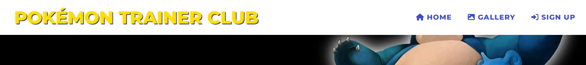

#### Mobile

  - The Navigation Bar for mobile devices is designed to be responsive, meaning it adjusts to fit the size and resolution of the device it is being viewed on. This allows for optimal user experience and accessibility, as the navigation options are always easily accessible and visible, regardless of the size of the device being used. This feature ensures that users can navigate the website with ease and convenience while on mobile.

### 2. Hero Image Section
  
  - The landing page displays few Pokemons together with dark background. Photo is accompanied by a list of short explanation what is page about..
  

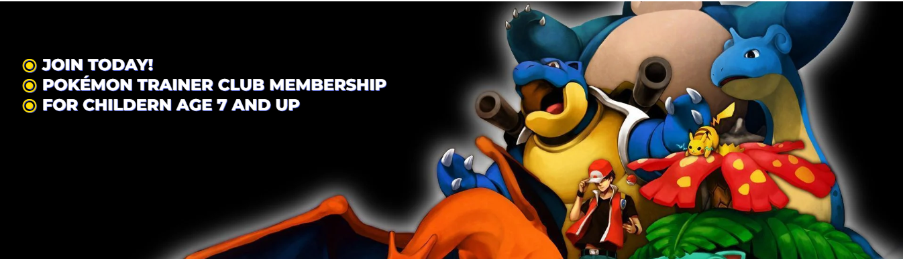

### 3. About Section

  - The About section welcomes Pokemon and it briefly introduce user to Pokemons, providing an short overview and background 

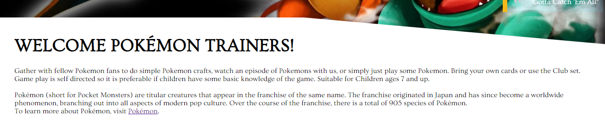

### 4.Image Caption Section

  - The Image section on the page includes a Quote from one of the trainers in the Pokemon series.  Additionally, it includes a heading with accompanying text that explains Pokemon Universe.
  - This section aims to give visitors a comprehensive understanding of the Pokemons. It also serves as an educational resource for those who are unfamiliar with the Pokemons and traiding card games but are interested in learning more.

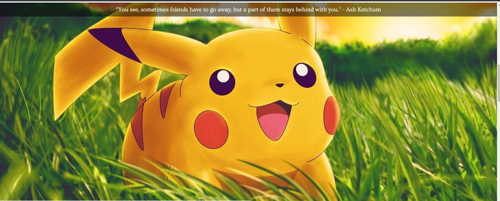

### 5. Pokemon Universe section

  - Pokemon Universe section of the page explaines Pokemon existance. 

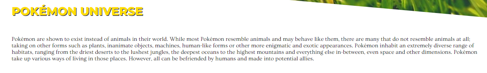

### 6. Timetable section 

  - Provides relevant times and venues

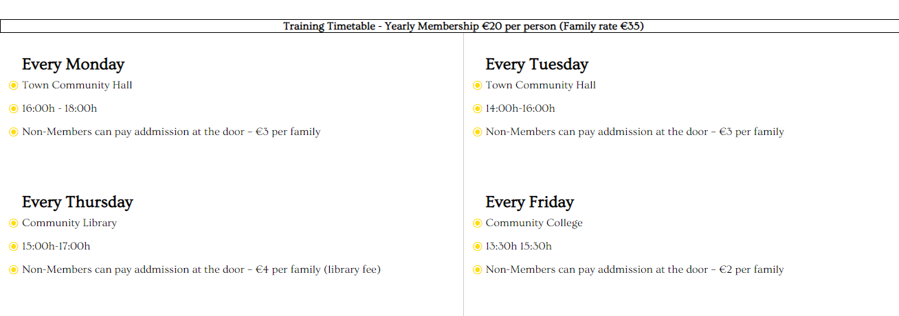

### 7. YouTube Section

  - The YouTube section on the page is placed with an aim to introduce a user with useful YouTube Pokemon Chanel. 
  - This section allows user to learn more about Pokemons, game and trading cards.

 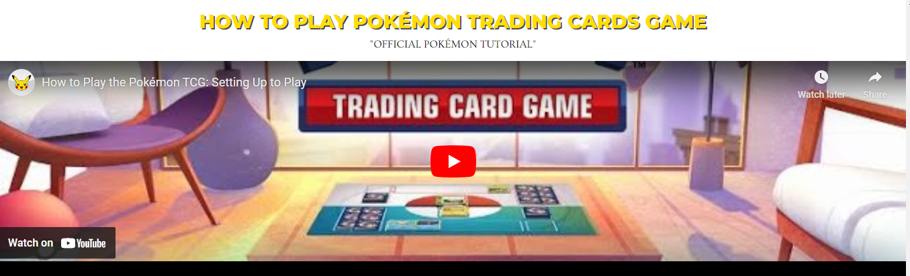

### 8. The Footer

  - The Footer section of the page includes a heading that directs visitors to the social media accounts of Pokemon Club
  - At the very bottom of the footer, there's a disclaimer that provides legal information about the website and its content.

## Gallery Page

- The Gallery page includes a heading with a blurred background that indicate that user is currently on gallery page accompanied by brief text that provides context and information about the images that are being showcased.
  - There is a total of 12 images on the page. This design ensures that the images are easily viewable regardless of the device being used. 

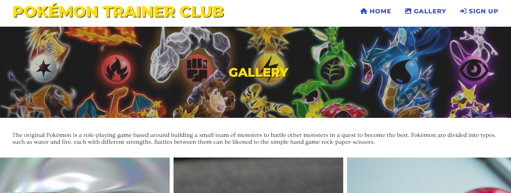

## The Sign Up Page

  - The form allows users to get membership.
  - Additionally, there is a fun survey that is designed to engage users and learn more about their interests. 

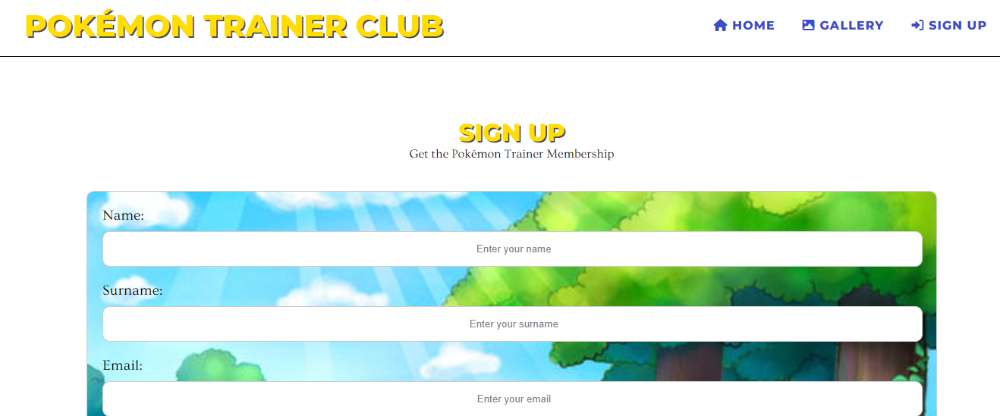

  - Below the form, there's a map that shows our main location. 

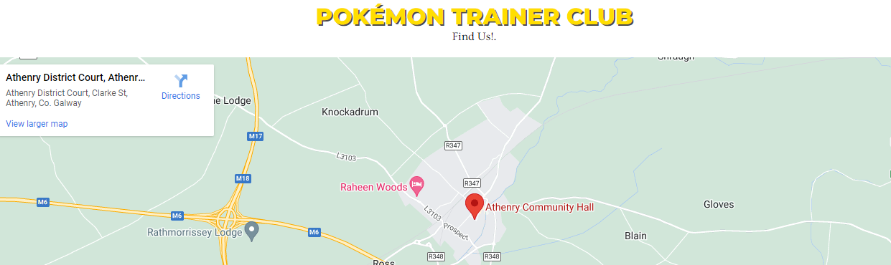

## Thank You Page

  - A thank you page is a webpage that is presented to the user after they have submitted a query on the sign-up page. The page includes a thank you message.

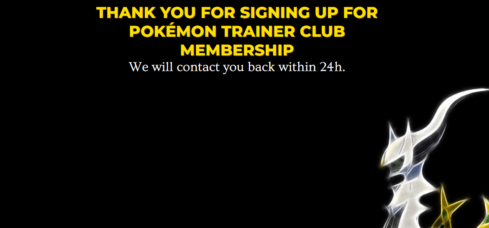

# 3. Technologies

 The technologies used in this project were HTML and CSS. The HTML was used to create the structure of the page, and CSS was used to style the page and to make the entire website interactive.

 * HTML5
 * CSS3
 * GitHub

 ## Programmes Used

*   [Google Fonts](https://fonts.google.com/)
      - Used to import specific fonts.
*   [Font Awesome](https://fontawesome.com/)
      - Used to add icon.
*   [GitHub](https://github.com/)
      - Used as the respository for the project code after being pushed from Git.
*   [W3C Markup Validation Service](https://validator.w3.org/)
      - Used to validate HTML.
*   [W3C CSS Validation Service](https://jigsaw.w3.org/css-validator/)
      - Used to validate CSS.

# 4. Testing

 ## Automated tests

  + HTML

 This website passed the w3c html validation. There were several errors but they have all been fixed. [W3C validator](https://validator.w3.org/).

  Validation results:

 Gallery validation: 

 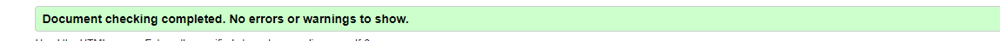

 Sign Up page validation:

 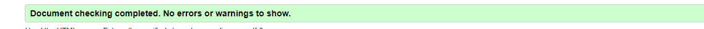

 Thank you page validation:

 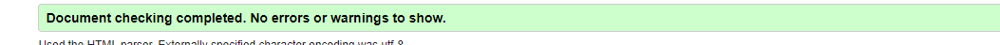

  + CSS

 During the testing, one error and one warning was found and corrected and thus passing through the official wc css validation  [W3C validator](https://jigsaw.w3.org/css-validator/). 

 validation results:
 ![css]

 [css]:/assets/images/jigsawval.png

 ## Manual Testing

   + Desktop

 Everything is working good with Mozilla Firefox, Google Chrome, laptop, large tablet screen and PC. Page loads and all of the page features are working.

   + Mobile
 
 Tested with Samsung s21, Samsung s22, Lenovo tab, iPhone 13,12 and 11. It is responsive as intended.

   +  chrome dev tools lighthouse

Lighthouse via Google Chrome

 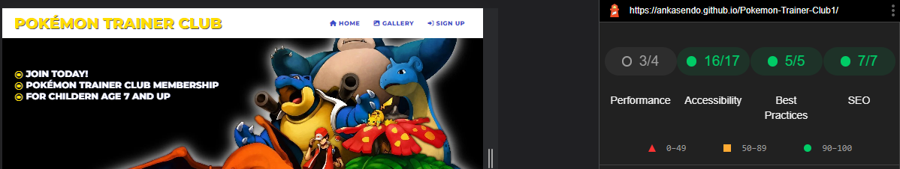

Lighthouse via Microsoft Edge 

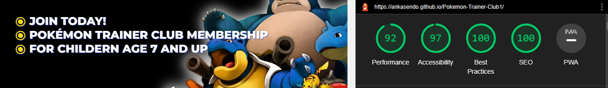

 + Mozila dev tools.

 Testing on all devices on mozila is good as well. 

# 5. Bugs

 No known bugs now. But there were quite a few problems at every stage. Whenever a problem was fixed another woud apear. In particular, media screens were adjusted few times.

 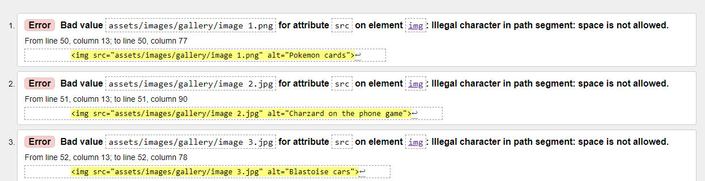

 
# 6. Deployment

- To succsessfully deploy your webpage, go to the GitHub repository and navigate to the 'Settings' tab. Then, select 'Pages' from the menu.
- Go to the 'Source' menu and select 'Main Branch'.
- After the page has auto-refreshed, you should see a display with your link - this will mean a successful deployment.
- Now, any changes pushed from GitPod to the master branch will be visible and take effect on the live project [live project link](https://ankasendo.github.io/Pokemon-Trainer-Club1/)

# 7. Credits

* [Stack Overflow](https://stackoverflow.com/)
* [W3 School](https://www.w3schools.com/) helped me with my research and understanding.
* [Youtube](https://www.youtube.com/watch?v=SX-_YLFdXlE&t=1s) 
* [Am I Responsive](https://ui.dev/amiresponsive) to create the main image for README file.
* [Pokemon website](https://www.pokemon.com/us)

## Photos

* [Pixelstalk.com](https://www.pixelstalk.net/pokemon-wallpapers-4k-free-download/)
* [Pexels.com](https://www.pexels.com/)
* [Pokemon.com](https://www.pokemon.com/us) 

# 8. Code/Acknowledgements
- I have recieved help from multiple sources to create this webpage. 
      There is a lot on this website that I didn't learn or fully understand through the course material. 
      These are the people or sites that have helped me or gave me the ideas to create what I have produced.

- [W3Schools](https://www.w3schools.com/)
      As a general reminder of HTML and CSS.
- The [slack](https://slack.com/intl/en-ie/https://slack.com/intl/en-ie/) community which i can always rely on. Questions and answers by fellow students on Slack were heavily consulted.
- I would like to thank the assessment team for taking their time to look over my project, Code institute Tutors and Love Running guided project.
